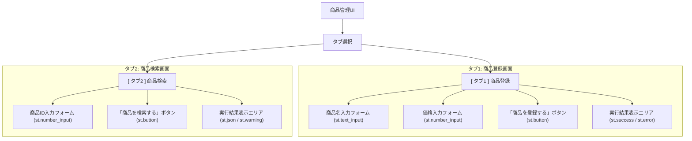

# 商品管理UI 仕様書

## 1. 概要

本仕様書は、商品管理APIを利用したシンプルなWeb UIの設計を定義します。
APIの既存機能（商品作成・個別取得）のみを利用し、新たな機能追加は行いません。
Streamlitフレームワークでの実装を前提とし、ワークショップ時間内（約20分）で完成可能な範囲にスコープを限定します。

## 2. ターゲットユーザー

- 商品の在庫を管理している会社の担当者
- PCやWebアプリケーションの操作に不慣れな初心者

## 3. コンセプト

**「登録」と「検索」— 2つの機能に特化した、迷わないシンプル画面**

ユーザーが混乱しないよう、機能を「商品を新しく登録する」「登録済みの商品をIDで探す」の2つに明確に分け、タブで切り替えるインターフェースを採用します。これにより、マニュアルがなくても直感的に操作できることを目指します。

## 4. 画面設計

Streamlitのタブ（`st.tabs`）機能を使い、「商品登録」と「商品検索」の2つの画面を切り替えます。

### 画面レイアウト

### 4.1. タブ1: 商品登録

新しい商品を登録するための画面です。

- **入力項目**:
    - **商品名**: テキスト入力 (`st.text_input`)
    - **価格**: 数値入力 (`st.number_input`, 0より大きい値のみ許可)
- **アクション**:
    - **「商品を登録する」ボタン**: クリックすると `POST /items` APIを呼び出します。
- **結果表示**:
    - **成功時**: `st.success()` を使い、作成された商品の情報（特に**商品ID**）を分かりやすく表示します。
      > 例: ✅ **登録完了！**\
      > 商品「新しいペン」を登録しました。\
      > **商品ID:** `123`
    - **失敗時**: `st.error()` を使い、APIからのエラーメッセージ（例: バリデーションエラー）を表示します。

### 4.2. タブ2: 商品検索

既存の商品をIDで検索するための画面です。

- **入力項目**:
    - **商品ID**: 数値入力 (`st.number_input`, 整数のみ許可)
- **アクション**:
    - **「商品を検索する」ボタン**: クリックすると `GET /items/{id}` APIを呼び出します。
- **結果表示**:
    - **成功時**: `st.json()` または `st.markdown` を使い、見つかった商品の詳細情報を表示します。
      > 例: **商品情報 (ID: 123)**
      > - **商品名**: 新しいペン
      > - **価格**: 150円
      > - **登録日時**: 2024-07-30 10:00:00
    - **失敗時（404 Not Found）**: `st.warning()` を使い、商品が見つからなかったことを伝えます。
      > 例: ⚠️ 商品ID `999` は見つかりませんでした。

## 5. 操作フロー

### 商品登録フロー

1.  ユーザーが「商品登録」タブを選択する。
2.  商品名と価格を入力する。
3.  「商品を登録する」ボタンをクリックする。
4.  UIがバックエンドの `POST /items` を呼び出す。
5.  結果表示エリアに、成功メッセージ（商品IDを含む）またはエラーメッセージが表示される。

### 商品検索フロー

1.  ユーザーが「商品検索」タブを選択する。
2.  商品IDを入力する。
3.  「商品を検索する」ボタンをクリックする。
4.  UIがバックエンドの `GET /items/{id}` を呼び出す。
5.  結果表示エリアに、見つかった商品の詳細、または「見つかりません」という警告が表示される。 